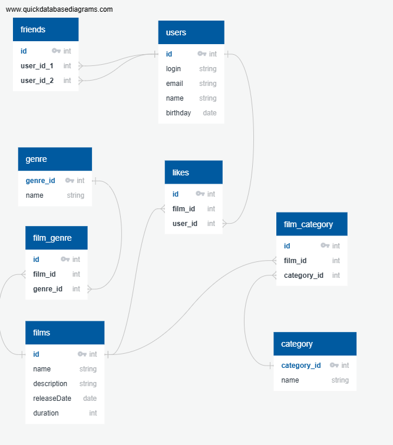

# java-filmorate

## Схема базы данных.



## Запросы к БД.

1. Получение всех пользователей

```
select 
	*
FROM
	films

```

2. Получение всех фильмов

```
 select 
	* 
 FROM
	users
	
```

3. Топ N наиболее популярных фильмов

```
 select 
	f.name, count(distinct l.user_id) as cnt_likes
 from films f
	left outer join likes l on l.film_id = f.id
 group by f.film_id,f.name
 order by cnt_likes desc
 limit n
```

4. Получение списка общих друзей
```
select  
	F1.user_id_2, u1.login, u1.name
from
	(select user_id_1, user_id_2
	from friends  where user_id_1 = 1) F1,
inner join 
	(select user_id_1, user_id_2
	from friends  where user_id_1 = 2) F2 on F1.user_id_2 = f2.user_id_2
inner outer users u1 on u1.id = f1.user_id_2
```

